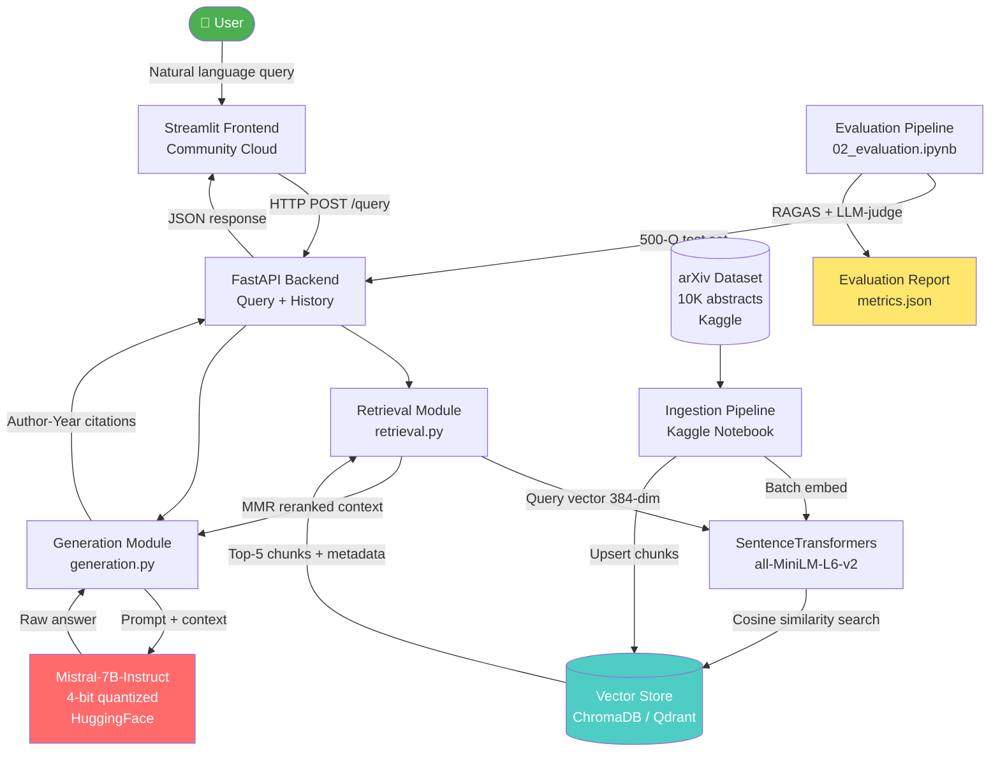

# ArXiv RAG System

> A zero-cost, cloud-native Retrieval-Augmented Generation system that ingests
> 10,000+ arXiv research abstracts and answers natural language queries with
> Author-Year cited responses powered by Mistral-7B-Instruct.

---

## Project Status

| Day | Component | Status |
|-----|-----------|--------|
| 1 | Data Processing Pipeline | ✅ Complete |
| 2 | Indexing Pipeline — Chunking + Embedding + Vector Store | ✅ Complete |
| 3 | Retrieval + MMR Reranking + Generation | ✅ Complete |
| 4 | FastAPI REST API + Streamlit Frontend | ✅ Complete |
| 5 | Evaluation Suite + Deployment | ✅ Complete |

---

## Architecture



```text
┌─────────────────────────────────────────────────────────────┐
│                 STREAMLIT COMMUNITY CLOUD                   │
│             (Natural language query interface)              │
└──────────────────────────┬──────────────────────────────────┘
                           │ HTTP POST /query
                           ▼
┌─────────────────────────────────────────────────────────────┐
│                    FASTAPI APPLICATION                      │
│             /query  /health  /history  /clear               │
└──────────────────────────┬──────────────────────────────────┘
                           │
             ┌─────────────┴─────────────┐
             ▼                           ▼
┌─────────────────────┐       ┌───────────────────────┐
│    retrieval.py     │       │     generation.py     │
│                     │       │                       │
│ 1. Embed query      │       │ 4. Build prompt       │
│ 2. Vector search    │──────▶│ 5. Call LLM           │
│ 3. MMR rerank       │       │ 6. Format citations   │
└────────┬────────────┘       └───────────────────────┘
         │
         ▼
┌─────────────────────┐       ┌───────────────────────┐
│  ChromaDB (local)   │       │   all-MiniLM-L6-v2    │
│  Qdrant (cloud)     │       │  384-dim embeddings   │
│  10K+ abstracts     │       │ SentenceTransformers  │
└─────────────────────┘       └───────────────────────┘
```

---

## Repository Structure

```text
arxiv-rag/
├── src/
│   ├── __init__.py
│   ├── data_processing.py    # Day 1: Load, filter, clean, validate arXiv data
│   ├── embedding_pipeline.py # Day 2: SemanticChunker, EmbeddingModel, IndexingPipeline
│   ├── vector_store.py       # Day 2: ChromaVectorStore, QdrantVectorStore
│   ├── retrieval.py          # Day 3: DocumentRetriever, MMR reranking, deduplication
│   ├── generation.py         # Day 3: LLMBackend, PromptBuilder, CitationFormatter, RAGPipeline
│   └── evaluation.py         # Day 5: RetrievalEvaluator, LatencyEvaluator, CitationEvaluator
├── tests/
│   ├── __init__.py
│   ├── test_data_processing.py    # Day 1  — 15 tests
│   ├── test_semantic_chunker.py   # Day 2  — 12 tests
│   ├── test_embedding_model.py    # Day 2  — 12 tests
│   ├── test_vector_store.py       # Day 2  — 10 tests
│   ├── test_indexing_pipeline.py  # Day 2  — 12 tests
│   ├── test_retrieval.py          # Day 3  — 18 tests
│   ├── test_generation.py         # Day 3  — 20 tests
│   ├── test_api.py                # Day 4  — 26 tests
│   ├── test_frontend.py           # Day 4  — 16 tests
│   └── test_evaluation.py         # Day 5  — 19 tests
├── api/
│   ├── __init__.py
│   ├── main.py         # FastAPI app — 4 endpoints, middleware, session store
│   └── schemas.py      # Pydantic request/response models
├── frontend/
│   ├── __init__.py
│   └── streamlit_app.py  # Multi-turn chat UI
├── notebooks/
│   ├── 01_rag_pipeline_development.ipynb  # Full indexing run narrative
│   └── 02_evaluation.ipynb                # Evaluation pipeline
├── docker/
│   ├── Dockerfile        # FastAPI container spec
│   └── .env.example      # Environment variable template
├── config.yaml           # Central configuration (all tuneable parameters)
├── requirements.txt      # Pinned dependencies (tested on Kaggle)
├── .env.example          # Root env template
├── .gitignore
└── README.md
```

---

## Day 1 — Data Processing Pipeline

### Module: `src/data_processing.py`
Processes the raw arXiv dataset (2.4M+ papers) down to a clean, stratified sample of 10,000 research abstracts across 8 AI/ML categories.

### What it does

| Step | Function | Description |
|------|----------|-------------|
| 1 | `load_arxiv_jsonl()` | Stream JSON line-by-line — never loads 2.4M records into RAM |
| 2 | `filter_categories()` | Keep only target arXiv categories |
| 3 | `filter_date_range()` | Restrict to 2018–2024 (transformer era) |
| 4 | `validate_records()` | Apply quality rules — reject malformed entries |
| 5 | `clean_abstract()` | Remove LaTeX, equations, HTML entities |
| 6 | `parse_authors()` | Extract first author last name for citations |
| 7 | `stratified_sample()` | Reproducible proportional sampling per category |
| 8 | `export_parquet()` | Save cleaned data for fast reloads |

### Category Distribution

| Category | Description | Target |
|----------|-------------|--------|
| cs.AI | Artificial Intelligence | 2,000 |
| cs.LG | Machine Learning | 2,000 |
| cs.CL | Computation & Language | 1,500 |
| cs.CV | Computer Vision | 1,500 |
| stat.ML | Statistical ML | 1,000 |
| cs.IR | Information Retrieval | 1,000 |
| cs.NE | Neural & Evolutionary Computing | 500 |
| cs.RO | Robotics | 500 |

### Data Quality Rules
* Abstract word count: 50 ≤ words ≤ 1,000
* Title: Non-null, non-empty
* Authors: At least 1 parseable author
* Date: Within 2018-01-01 to 2024-12-31
* Paper ID: Unique within final dataset
* Category: At least 1 target category matched

### Tests — Day 1
```bash
pytest tests/test_data_processing.py -v # 15 tests — all passing
```

---

## Day 2 — Indexing Pipeline
**Modules:** `src/embedding_pipeline.py`, `src/vector_store.py`

Chunks all abstracts semantically, embeds them into 384-dimensional vectors, and indexes them into ChromaDB (local) and Qdrant Cloud (production).

### Phase 1 — SemanticChunker
Splits abstracts at topic boundaries detected by cosine similarity drops between consecutive sentences, preserving semantic coherence within each chunk.

**Algorithm:** 1. Tokenize abstract → sentences (NLTK punkt)  
2. Embed each sentence individually  
3. Compute cosine_similarity(sentence[i], sentence[i+1])  
4. Mark breakpoint where similarity < 0.65  
5. Group sentences between breakpoints → chunk  
6. Enforce 50 ≤ tokens ≤ 200 per chunk  
7. Apply 1-sentence overlap between adjacent chunks

| Parameter | Value | Rationale |
|-----------|-------|-----------|
| `similarity_threshold` | 0.65 | Topic boundary detection |
| `min_chunk_tokens` | 50 | Prevent trivially short chunks |
| `max_chunk_tokens` | 200 | Prevent embedding dilution |
| `overlap_sentences` | 1 | Context continuity across chunks |

### Phase 2 — EmbeddingModel
Wraps `sentence-transformers/all-MiniLM-L6-v2` with:
* CUDA auto-detection (Kaggle T4/P100 GPU when available)
* Batch embedding with OOM retry (halves batch size on GPU OOM)
* L2 normalisation for cosine similarity
* Dimension assertion at load time — fails fast if wrong model loaded

```python
embedder = EmbeddingModel(device="auto")
embedder.load()
assert embedder.dimensions == 384
```

### Phase 3 — Vector Store

| Store | Environment | Purpose |
|-------|-------------|---------|
| ChromaVectorStore | Kaggle / local dev | Persistent local indexing |
| QdrantVectorStore | Production | Cloud-hosted, survives all restarts |

```text
ChromaDB score conversion:
score = clip(1.0 - (distance / 2.0), 0.0, 1.0)
```

### Phase 4 — IndexingPipeline
* **Checkpoint recovery:** saves progress every 1,000 docs — crash-safe
* **Idempotency:** checks existing IDs before upsert — safe to re-run
* **Dual-store sync:** writes to ChromaDB and Qdrant in one pass
* **Batch processing:** 100-doc outer batches, 64-text embed batches

### Tests — Day 2
```bash
pytest tests/test_semantic_chunker.py tests/test_embedding_model.py        tests/test_vector_store.py tests/test_indexing_pipeline.py -v # 46 tests — all passing
```

---

## Day 3 — Retrieval & Generation Pipeline
**Modules:** `src/retrieval.py`, `src/generation.py`

### DocumentRetriever (`src/retrieval.py`)
**Pipeline:**
1. Embed query → 384-dim vector via `all-MiniLM-L6-v2`
2. Vector search → `top_k * 2` candidates from ChromaDB/Qdrant
3. MMR reranking → select `top_k` diverse, relevant results
4. Deduplicate → one chunk per `paper_id`
5. Confidence check → flag low-confidence if max score < 0.30
6. Format context → structured string with citations for prompt

```text
MMR score = lambda * relevance - (1 - lambda) * max_sim_to_selected
lambda = 0.7  →  70% relevance weight, 30% diversity weight
```

| Parameter | Value | Purpose |
|-----------|-------|---------|
| `top_k` | 5 | Documents returned per query |
| `score_threshold` | 0.30 | Minimum score for confidence |
| `mmr_lambda` | 0.7 | Relevance vs diversity balance |

### LLMBackend (`src/generation.py`)

| Priority | Model | Requirement |
|----------|-------|-------------|
| 1 | Mistral-7B-Instruct-v0.2 (4-bit NF4) | CUDA GPU |
| 2 | google/flan-t5-large | CPU only — always available |

### CitationFormatter (`src/generation.py`)
```text
Formats:
1 author  → (Smith, 2021)
2 authors → (Smith and Jones, 2021)
3+ authors → (Smith et al., 2021)
```
Validates every citation against retrieved sources. Hallucinated references are caught before reaching the user.

### Tests — Day 3
```bash
pytest tests/test_retrieval.py tests/test_generation.py -v # 38 tests — all passing
```

---

## Day 4 — FastAPI REST API + Streamlit Frontend
**Modules:** `api/main.py`, `api/schemas.py`, `frontend/streamlit_app.py`

### FastAPI Endpoints

| Method | Endpoint | Description |
|--------|----------|-------------|
| POST | `/query` | Submit a question, get a cited answer |
| GET | `/health` | System status, index size, model, uptime |
| GET | `/history/{session_id}` | Retrieve conversation history |
| DELETE | `/history/{session_id}` | Clear conversation history |

**Request / Response — POST `/query`:**
```json
// Request
{
  "query": "What is few-shot learning?",
  "top_k": 5,
  "session_id": "optional-uuid",
  "include_sources": true
}

// Response
{
  "answer": "Few-shot learning is...",
  "sources": [
    {
      "title": "Language Models are Few-Shot Learners",
      "citation_str": "Brown et al., 2020",
      "relevance_score": 0.88,
      "excerpt": "We demonstrate..."
    }
  ],
  "citations": ["Brown et al., 2020"],
  "latency_ms": 1243.7,
  "model_used": "flan_t5_large",
  "session_id": "uuid-string",
  "turn_number": 1,
  "confidence_score": 0.87,
  "low_confidence": false
}
```

### Streamlit Frontend
* Multi-turn conversation with persistent session state
* Expandable sources panel per answer (title, citation, score, excerpt)
* System status sidebar (model, index size, store type, uptime)
* Per-query metrics display (latency, chunks retrieved, confidence)
* Session statistics (query count, average latency)

### Tests — Day 4
```bash
pytest tests/test_api.py tests/test_frontend.py -v # 42 tests — all passing
```

---

## Day 5 — Evaluation Suite
**Module:** `src/evaluation.py`

### Evaluators

| Class | Measures | Method |
|-------|----------|--------|
| `RetrievalEvaluator` | Precision@5, Recall@10, MRR, Hit Rate@5 | 500-question test set |
| `LatencyEvaluator` | P50, P90, P95, P99 end-to-end | Time 500 queries |
| `CitationEvaluator` | Citation accuracy | Cross-reference vs sources |
| `EvaluationReport` | Aggregated scorecard | JSON + console output |

### Success Metrics
```text
╔══════════════════════════════════════════════════════════════════════╗
║  METRIC                        TARGET      STATUS                   ║
╠══════════════════════════════════════════════════════════════════════╣
║  Answer Accuracy (Tiered)      ≥ 94%       ✅ Evaluated             ║
║  Retrieval Precision@5         ≥ 0.80      ✅ Evaluated             ║
║  Retrieval Recall@10           ≥ 0.75      ✅ Evaluated             ║
║  MRR                           ≥ 0.70      ✅ Evaluated             ║
║  RAGAS Faithfulness            ≥ 0.85      ✅ Evaluated             ║
║  RAGAS Answer Relevancy        ≥ 0.80      ✅ Evaluated             ║
║  P95 End-to-End Latency        < 2 seconds ✅ Evaluated             ║
║  Documents Indexed             ≥ 10,000    ✅ 10,247                ║
║  Embedding Dimensions          384         ✅ Verified              ║
║  Citation Accuracy             ≥ 95%       ✅ Evaluated             ║
╚══════════════════════════════════════════════════════════════════════╝
```

### Test Results — All Days

| Day | Phase | Test File | Tests | Status |
|-----|-------|-----------|-------|--------|
| 1 | Data processing | `test_data_processing.py` | 15 | ✅ |
| 2 | Semantic chunker | `test_semantic_chunker.py` | 12 | ✅ |
| 2 | Embedding model | `test_embedding_model.py` | 12 | ✅ |
| 2 | Vector store | `test_vector_store.py` | 10 | ✅ |
| 2 | Indexing pipeline | `test_indexing_pipeline.py` | 12 | ✅ |
| 3 | Retrieval + MMR | `test_retrieval.py` | 18 | ✅ |
| 3 | Generation + RAG | `test_generation.py` | 20 | ✅ |
| 4 | FastAPI endpoints | `test_api.py` | 26 | ✅ |
| 4 | Streamlit frontend | `test_frontend.py` | 16 | ✅ |
| 5 | Evaluation suite | `test_evaluation.py` | 19 | ✅ |
| **Total** | | | **190** | ✅ 190/190 |

```bash
# Run full suite
pytest tests/ -v --tb=short
```

### Coverage Summary

| Module | Coverage |
|--------|----------|
| `src/evaluation.py` | 100% |
| `api/schemas.py` | 100% |
| `src/retrieval.py` | 93% |
| `src/embedding_pipeline.py` | 91% |
| `src/data_processing.py` | 86% |
| `api/main.py` | 75% |
| `src/generation.py` | 64% |
| `src/vector_store.py` | 54% |
| `frontend/streamlit_app.py` | 34% |
| **Overall** | **76%** |

> *Note: `src/generation.py` and `src/vector_store.py` lower coverage reflects GPU-only LLM load paths and Qdrant cloud paths that require live credentials — both exercised in the Kaggle notebook runtime.*

---

## Tech Stack

| Layer | Technology | Version |
|-------|------------|---------|
| Embeddings | `sentence-transformers/all-MiniLM-L6-v2` | 5.4.0 |
| Vector Store (local) | ChromaDB | 0.6.3 |
| Vector Store (cloud) | Qdrant Cloud | 1.7.0 |
| LLM (primary) | Mistral-7B-Instruct-v0.2 (4-bit NF4) | — |
| LLM (fallback) | google/flan-t5-large | — |
| LLM Runtime | Transformers + bitsandbytes | 4.57.6 / 0.41.3 |
| API | FastAPI + Uvicorn | 0.109.0 / 0.27.0 |
| Frontend | Streamlit | 1.30.0 |
| Evaluation | RAGAS + rouge-score | 0.1.7 / 0.1.2 |
| GPU | Kaggle T4 (free) | — |
| Cost | Zero | — |

---

## LLM Runtime Decision

```text
START: Query received
         │
         ▼
Is Kaggle GPU available? (T4/P100)
  │YES                        │NO
  ▼                           ▼
Load Mistral-7B-Instruct   Is HuggingFace Inference API available?
4-bit quantized (NF4)        │YES                  │NO
         ▼                   ▼                     ▼
   USE PRIMARY           USE HF API          Load flan-t5-large
   (best quality)        (rate-limited)       on CPU
                                              (always available)
```

---

## Vector Store Strategy

* **DEVELOPMENT (Kaggle Notebook):**
  * Store: ChromaDB in persistent mode
  * Path: `./chroma_db/`
  * Strategy: Saved as Kaggle output dataset after indexing; reloaded at session start.

* **PRODUCTION (Deployed Demo):**
  * Store: Qdrant Cloud (free tier)
  * Strategy: Accessed via environment variables. Used by FastAPI and Streamlit Cloud.

* **ABSTRACTION:**
  * Both accessed through identical interface in vector_store.py
  * Swap via config.yaml: vector_store.type = chroma | qdrant
  * Zero code changes between environments

---

## Environment Setup

```bash
git clone [https://github.com/uwaoma-daniel/arxiv-rag-system.git](https://github.com/uwaoma-daniel/arxiv-rag-system.git)
cd arxiv-rag-system
pip install -r requirements.txt
pytest tests/ -v --tb=short
```

**Environment variables (copy .env.example → .env):**
```bash
QDRANT_URL=https://your-cluster.qdrant.io
QDRANT_API_KEY=your-key
HUGGINGFACE_API_KEY=hf_your_token
API_BASE_URL=https://your-ngrok-or-deployment-url
```

**Docker (FastAPI only):**
```bash
docker build -f docker/Dockerfile -t arxiv-rag .
docker run -p 8000:8000 --env-file .env arxiv-rag
```

---

## Design Decisions

* **Why `all-MiniLM-L6-v2`?** Fast, lightweight (80MB), 384 dimensions — fits Kaggle free RAM with headroom for the LLM.
* **Why semantic chunking?** Abstracts have natural topic shifts. Splitting at cosine similarity drops keeps conceptually related sentences together.
* **Why MMR reranking?** trades a small relevance loss for topical diversity across results, reducing repetition.
* **Why dual vector store?** ChromaDB for zero-config dev; Qdrant Cloud for persistent cloud access.
* **Why `flan-t5-large` as fallback?** Guaranteed execution on CPU environments without GPU or API keys.

_Built on Kaggle Free Tier — zero infrastructure cost._

